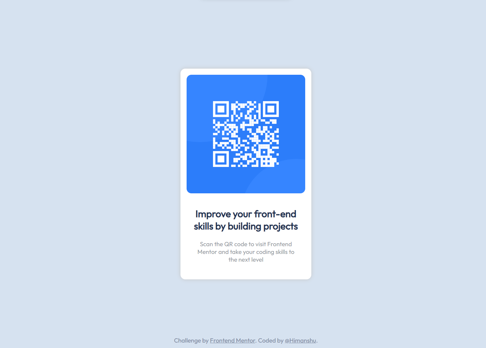

# Frontend Mentor - QR code component solution

This is a solution to the [QR code component challenge on Frontend Mentor](https://www.frontendmentor.io/challenges/qr-code-component-iux_sIO_H). Frontend Mentor challenges help you improve your coding skills by building realistic projects.

## Table of contents

- [Overview](#overview)
  - [Screenshot](#screenshot)
  - [Links](#links)
- [My process](#my-process)
  - [Built with](#built-with)
  - [What I learned](#what-i-learned)
  - [Useful resources](#useful-resources)
- [Author](#author)
- [Acknowledgments](#acknowledgments)

## Overview

### Screenshot

### Links

- Solution URL: [Solution](https://github.com/Himanshu-196018/qr_code_component_challenge)
- Live Site URL: [Demo/site](https://himanshu-196018.github.io/qr_code_component_challenge/)

## My process

### Built with

- Semantic HTML5 markup
- CSS custom properties
- Flexbox
- CSS Grid
- Mobile-first workflow

### What I learned

This project helped me to improve my basic styling and palcement of different elements by building a QR component.

### Useful resources

- [Markdown](https://www.markdownguide.org/) - This helped me to understand and write down markdown.

## Author

- Website - [Himanshu]("")
- Github - [@Himanshu_196018](https://github.com/Himanshu-196018)
- LinkedIn - [@Himanshu](www.linkedin.com/in/himanshu-kumar-2b7993167)

## Acknowledgments

I would personally recommend to checkout [Frontend Mentor](https://www.frontendmentor.io/). This is a very useful site, it will help you to improve your Frontend Developing skills by building projects through challanges.
